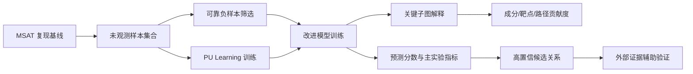

# MSAT 复现基础上的中药不良反应预测模型改进技术方案

**文档版本：** v1.0  
**撰写日期：** 2026-06-24  
**适用对象：** 导师、课题组讨论、后续开题或阶段汇报  
**项目基础：** 已完成 MSAT 论文主实验代码复现、数据协议核查、Table 5 可复现性诊断与复现缺口分析  

## 摘要

本项目当前阶段已经完成对 MSAT 模型主实验流程的复现与校验。基于现有公开代码与本地数据，模型在核心评价指标上已经接近论文主实验结果，说明当前工程实现、数据解析、训练流程与评价协议整体处在正确方向上。同时，复现过程中暴露出一个对后续研究具有重要价值的问题：原始任务将“未观测到的药物-副作用关联”近似视为负样本，但在真实医学知识图谱和药物不良反应数据中，未观测不等于无关联。这一设定会引入标签噪声，并可能影响模型对真实风险关系的识别能力。

结合导师提出的建议，本方案建议将后续研究重点确定为：**基于不完整标签学习与机制解释的中药不良反应预测模型改进**。具体而言，以“可靠负样本构建与 PU Learning”为主线，以“关键机制子图提取与贡献度解释”为第二创新点，以“外部证据辅助验证”为补充支撑，并将“因果图与混杂因素建模”作为后续可拓展方向。该路线既承接当前 MSAT 复现成果，又能针对复现中发现的真实问题提出可验证、可发表、可逐步推进的模型改进方案。

## 1. 当前研究基础

### 1.1 已完成的复现工作

当前项目已经完成以下核心工作：

1. 复现 MSAT 主实验训练流程，包括数据读取、特征构建、模型训练、交叉验证与指标汇总。
2. 核查论文协议与本地代码实现之间的差异，重点检查随机种子、折划分、负样本比例、训练配置、评价指标与 checkpoint 来源。
3. 清理并隔离实验产物，降低运行日志、临时文件、模型权重和诊断输出对源码仓库的污染。
4. 对 Table 5 的可复现性进行了独立诊断，明确当前公开数据和本地可用文件不足以严格还原论文 Table 5。
5. 将可复现主实验与不可完全复现的辅助分析进行区分，避免用不完整材料强行得出论文等价结论。

### 1.2 主实验复现状态

当前主实验已经达到较高复现程度。根据现有结果文件，模型核心性能约为：

| 指标 | 当前复现结果 | 说明 |
| --- | ---: | --- |
| AUC | 0.9793 | 与论文主实验表现接近 |
| AUPRC | 0.9771 | 与主实验预期一致 |
| F1 | 0.9315 | 达到较高预测性能 |
| MCC | 0.8625 | 说明分类质量较稳定 |

上述结果表明，当前复现并非停留在代码能运行的层面，而是已经基本重建了论文主实验的核心性能表现。下一阶段更适合从“复现”转向“基于复现的研究问题挖掘与模型改进”。

### 1.3 Table 5 复现缺口

Table 5 的作用主要是展示模型对具体药物-副作用案例的预测能力，并通过文献证据或外部证据进行解释性佐证。它不是主实验性能指标表，而是案例层面的辅助验证表。

当前诊断结果显示，Table 5 在现有公开材料下无法严格复现，主要原因包括：

1. 论文列出的部分药物-副作用 pair 在当前本地训练图或 OOF 预测结果中无法完整定位。
2. 当前可用 checkpoint 与预期 checkpoint 的哈希不一致，不能证明其为论文原始生成 Table 5 所使用的模型权重。
3. 论文 Table 5 的候选生成逻辑、排序规则、证据筛选过程和人工筛选标准未完全公开。
4. 当前公开代码更偏向主实验训练和指标复现，而不是完整公开论文中所有案例表的生成流程。

因此，Table 5 的复现缺口不应被简单视为项目失败，而应被转化为后续研究动机：现有模型虽然预测性能强，但在候选关系可信度、未标注样本处理和预测解释方面仍存在进一步改进空间。

## 2. 复现过程中暴露出的关键科学问题

### 2.1 未观测关系不等于真实负样本

在药物副作用预测任务中，正样本通常来自已经被数据库、文献或报告系统记录的药物-副作用关联；负样本则往往来自未记录的组合。然而，未记录可能意味着真实无关联，也可能意味着尚未被发现、尚未被报告、尚未被数据库收录，或因为暴露人群不足而无法观察到。

如果直接将所有未观测组合作为负样本，模型训练会面临以下问题：

1. 部分潜在正样本被错误标注为负样本。
2. 模型可能学习到数据库收录偏差，而不是真实生物医学风险关系。
3. 高风险但证据稀疏的组合可能在训练中被压低预测分数。
4. 后续案例解释容易混入由标签噪声导致的伪相关。

因此，负样本策略是当前任务中最直接、最可落地、也最具有研究价值的改进方向。

### 2.2 模型预测性能强，但机制解释仍不足

MSAT 使用多源特征与注意力机制建模药物、靶点、成分、疾病和副作用之间的复杂关系。该模型能够取得较高预测性能，但当前复现结果仍然难以回答以下问题：

1. 对某一个药物-副作用预测，模型主要依赖哪些成分、靶点或路径？
2. 注意力权重是否可以稳定反映机制贡献，而不仅仅是中间计算结果？
3. 不同机制子图对预测分数的贡献是否可以被量化？
4. 模型能否给出便于医学讨论的解释，而不是只输出概率分数？

因此，需要在模型复现基础上增加机制子图提取和贡献度量化模块，使模型从“能预测”进一步走向“能解释”。

### 2.3 混杂因素与报告偏倚需要被纳入研究视野

药物副作用数据天然受到合并用药、适应症偏倚、报告偏倚、暴露人群差异、数据库覆盖差异等因素影响。这些因素可能导致模型学习到非因果关联。例如，某副作用可能并非由某药物直接导致，而是由适应症本身、伴随用药或特定人群特征造成。

当前项目数据主要以知识图谱和药物-副作用关联为基础，尚不具备完整个体级暴露、时间序列、合并用药和人群统计变量。因此，严格因果推断暂时不宜作为第一阶段主攻方向。但可以先建立因果问题框架，为后续引入 FAERS、电子病历或真实世界用药数据时提供理论接口。

### 2.4 外部证据可以辅助验证，但不能直接替代标注

导师提出可补充 DeepSeek 等大模型对副作用进行评估，这一方向有实际价值，但需要明确边界。大模型适合用于文献摘要、证据筛选、候选关系解释和人工审核辅助，不适合直接作为金标准标签来源。

如果直接使用大模型输出作为训练标签，可能引入幻觉、知识污染和循环验证问题。更稳妥的做法是将大模型定位为“证据辅助层”，用于帮助整理 PubMed、DrugBank、SIDER、FAERS 或说明书中的外部证据，并通过缓存、引用和人工复核保证可追溯性。

## 3. 总体研究目标

本项目后续目标是：在 MSAT 主实验复现基础上，构建一个面向中药不良反应预测的改进框架，使模型在处理不完整标签、降低关联性噪声、提供机制解释和辅助证据验证方面优于原始 MSAT。

具体目标包括：

1. 提出可靠负样本构建策略，降低将潜在正样本误当作负样本带来的训练噪声。
2. 引入 PU Learning 或正样本-未标注样本学习思想，使模型更符合药物副作用数据的不完整标注特征。
3. 构建面向单个预测结果的关键机制子图解释方法，量化成分、靶点和通路对预测结果的贡献。
4. 建立外部证据辅助验证流程，用于支持高置信预测案例的文献证据追踪和解释性展示。
5. 在不破坏原始复现实验协议的前提下，通过消融实验和对比实验验证每个模块的实际贡献。

## 4. 技术路线总览

建议将后续模型暂命名为 **PU-XMSAT**，即 Positive-Unlabeled and Explainable MSAT。该名称用于内部技术文档和实验记录，正式论文中可根据最终创新点再调整。

整体框架包括四个模块：

1. **原始 MSAT 表征学习模块**：保留已经复现成功的模型主体，作为稳定基线。
2. **可靠负样本选择模块**：从未观测药物-副作用组合中筛选更可信的负样本，避免将高风险潜在正样本直接标为负。
3. **PU Learning 训练模块**：将未观测样本建模为未标注样本，而不是简单建模为负样本。
4. **机制解释与证据验证模块**：提取关键成分、靶点、路径和外部证据，提高模型解释性。

## 5. 技术路线一：可靠负样本与 PU Learning

### 5.1 问题定义

设药物集合为 D，副作用集合为 S。已观测正样本集合为 P，未观测组合集合为 U。传统二分类设定将 P 作为正样本，将 U 中采样得到的组合作为负样本。但在本任务中，U 并不等价于真实负样本集合 N。

因此，改进目标是从 U 中识别更可靠的负样本，或直接采用 PU Learning 方法在 P 和 U 上训练模型。

### 5.2 可靠负样本筛选策略

可以从以下角度构建可靠负样本分数：

1. **结构距离分数**：如果某药物与某副作用在知识图谱上的最短路径、共同靶点、共同疾病或共同成分联系很弱，则其作为可靠负样本的概率更高。
2. **相似药物排除策略**：如果某药物的相似药物已经与某副作用有关联，则该未观测组合不应轻易作为负样本。
3. **副作用流行度校正**：高频副作用更容易被报告，低频副作用更容易漏标，需要避免简单按频率采样造成偏差。
4. **模型低置信筛选**：使用基线 MSAT 对 U 进行预打分，将稳定低分组合视为可靠负样本候选。
5. **多策略交集筛选**：只有同时满足结构距离远、相似药物无支持、基线预测低分的组合才进入可靠负样本集合。

最终可以得到一个可靠负样本集合 RN，并用其替换原始随机负采样策略。

### 5.3 PU Learning 策略

PU Learning 将训练数据划分为正样本 P 和未标注样本 U，不强行假设 U 全部为负样本。可采用以下实现路径：

1. **Weighted PU Loss**：为 U 中样本分配较低负标签权重，降低潜在误标样本对训练的破坏。
2. **Non-negative PU Risk**：估计正类先验概率，构建非负风险估计，避免训练过程出现风险估计偏置。
3. **Self-paced PU Training**：训练初期只使用可靠负样本，后期逐步加入更多未标注样本，并根据模型分数动态调整权重。
4. **Positive Prior Calibration**：根据已知正样本比例、外部数据库覆盖率或验证集表现估计正类先验。

第一阶段建议优先实现 Weighted PU Loss，因为它工程风险最低，最容易与当前 MSAT 训练脚本兼容。

### 5.4 预期贡献

该路线对应一个清晰的论文级贡献点：原始 MSAT 将未观测组合采样为负样本，本研究则针对药物副作用数据的不完整标注问题提出更合理的负样本与 PU 学习机制。该贡献与复现过程中发现的问题直接相连，具有明确的问题来源和实验验证路径。

## 6. 技术路线二：关键机制子图解释与贡献度量化

### 6.1 问题定义

对于一个预测为高风险的药物-副作用 pair，模型需要回答：为什么预测该药物可能导致该副作用？在中药场景中，更具体的问题是：哪些成分、靶点、疾病或生物通路支撑了这个预测？

### 6.2 子图提取方法

建议从以下三个层次提取机制子图：

1. **注意力驱动子图**：读取模型内部注意力权重，提取高权重节点和边。
2. **路径约束子图**：限制在药物-成分-靶点-疾病-副作用等可解释路径模板中，避免输出医学意义较弱的任意连接。
3. **扰动贡献子图**：逐个屏蔽成分、靶点或路径，观察预测分数变化，将分数下降幅度作为贡献度。

### 6.3 贡献度量化方法

可以采用以下指标：

1. **Attention Score**：节点或边在模型注意力中的权重。
2. **Perturbation Drop**：移除节点、边或路径后预测分数下降幅度。
3. **Path Support Count**：同一机制路径被多少药物、靶点或文献证据支持。
4. **SHAP-style Contribution**：在可控规模的子图内用近似 Shapley 方法估计局部贡献。

第一阶段建议采用 Attention Score 与 Perturbation Drop 的组合，因为这两者可以直接从现有模型与图结构中得到，不需要立即重写模型主体。

### 6.4 输出形式

对于每一个高置信预测案例，建议输出以下内容：

1. 药物名称、副作用名称、预测分数。
2. Top-K 关键成分。
3. Top-K 关键靶点。
4. Top-K 机制路径。
5. 每个关键节点或路径的贡献度。
6. 外部证据摘要与证据来源。

该模块可直接服务于 Table 5 类案例表的升级版本，使案例表不再只是“预测结果 + 文献佐证”，而是变成“预测结果 + 机制子图 + 贡献量化 + 外部证据”。

## 7. 技术路线三：外部证据辅助验证

### 7.1 数据来源

可优先考虑以下外部证据来源：

1. PubMed 文献摘要与关键词。
2. SIDER 药物副作用数据库。
3. DrugBank 药物说明与靶点信息。
4. FAERS 不良事件报告。
5. 药品说明书或权威药典资料。

### 7.2 大模型辅助方式

DeepSeek 等大模型可以用于以下任务：

1. 从摘要中判断是否存在药物-副作用相关描述。
2. 将文献证据分为直接证据、间接机制证据、无关证据和反向证据。
3. 摘要化候选机制路径。
4. 辅助生成案例解释文本。

但大模型输出必须保留引用来源，并且不能直接作为训练标签。建议采用“检索-摘要-人工复核”的方式使用大模型。

### 7.3 证据分级

建议将证据分为四级：

| 等级 | 含义 | 用途 |
| --- | --- | --- |
| A | 数据库或说明书直接记录该副作用 | 强证据 |
| B | 文献直接报告该药物与该副作用相关 | 强证据 |
| C | 文献支持相关成分、靶点或机制路径 | 间接机制证据 |
| D | 暂无证据或证据不一致 | 保留候选 |

该分级可以用于后续案例表、人工审核和模型解释评价。

## 8. 因果图方向的定位

导师建议中提到的因果图和因果论具有重要价值，尤其适合处理合并用药、适应症偏倚、报告偏倚和暴露人群差异等混杂因素。但从当前项目数据条件看，严格因果推断需要更细粒度数据，例如个体用药记录、时间顺序、合并用药、适应症、人群特征和暴露基数。

因此建议将因果方向分为两个阶段：

1. **当前阶段：因果问题建模与偏倚识别。** 用 DAG 描述药物、副作用、适应症、合并用药、报告概率和暴露人群之间的关系，明确当前模型可能受到哪些混杂影响。
2. **后续阶段：引入真实世界数据后进行因果校正。** 如果能够获得 FAERS、电子病历或真实世界队列数据，再考虑倾向评分、逆概率加权、因果图约束表示学习等方法。

这样处理既回应导师建议，又避免在当前数据条件不足时过早承诺严格因果结论。

## 9. 实验设计

### 9.1 基线模型

实验应保留以下基线：

1. 原始 MSAT 复现模型。
2. 原始随机负采样 MSAT。
3. 可靠负样本 MSAT。
4. PU Loss MSAT。
5. PU Loss + 机制解释增强模型。

### 9.2 主实验指标

继续沿用论文主实验指标：

1. AUC
2. AUPRC
3. F1
4. MCC
5. Precision
6. Recall

这些指标可以保证新方法与原始 MSAT 在同一协议下比较。

### 9.3 标签噪声鲁棒性实验

建议增加以下实验：

1. 在未标注样本中混入不同比例潜在正样本，比较不同负采样策略的鲁棒性。
2. 对高频副作用和低频副作用分别评估模型性能。
3. 对高相似药物群体和低相似药物群体分别评估模型误判情况。

### 9.4 消融实验

建议设置以下消融：

| 模型 | 目的 |
| --- | --- |
| MSAT | 原始复现基线 |
| MSAT + RN | 验证可靠负样本作用 |
| MSAT + PU Loss | 验证 PU 学习作用 |
| MSAT + RN + PU Loss | 验证两者组合效果 |
| MSAT + RN + PU Loss + Explainer | 验证解释模块与案例质量 |
| MSAT + Evidence Screening | 验证外部证据筛选对案例表的支持 |

### 9.5 解释性评价

解释性模块可从以下方面评价：

1. 关键成分或靶点是否能被文献支持。
2. Top-K 子图移除后模型分数是否显著下降。
3. 不同随机种子下关键子图是否稳定。
4. 解释结果是否能辅助人工判断候选关系可信度。

### 9.6 Table 5 升级实验

原论文 Table 5 可作为案例表模板，但不应强行复刻。建议构建新的“Table 5-style case study”，包括：

1. 高置信新增候选药物-副作用关系。
2. 模型预测分数。
3. 可靠负样本或 PU 模型下的分数变化。
4. 关键机制子图。
5. 外部证据等级。
6. 文献或数据库来源。

这样既承接原论文展示方式，又能体现本研究改进点。

## 10. 预期创新点

本方案的预期创新点包括：

1. **任务设定改进：** 将中药不良反应预测中的未观测关系重新建模为未标注样本，而不是简单负样本。
2. **训练策略改进：** 提出可靠负样本选择和 PU Learning 融合策略，降低标签噪声。
3. **解释性改进：** 从模型注意力和扰动贡献中提取关键机制子图，量化成分、靶点和路径贡献。
4. **证据验证改进：** 构建外部证据分级和大模型辅助筛选流程，提高案例分析可信度。
5. **复现驱动研究：** 从论文复现中发现真实缺口，并将缺口转化为新的研究问题。

## 11. 风险与应对

| 风险 | 影响 | 应对策略 |
| --- | --- | --- |
| PU Learning 改进幅度不明显 | 难以形成性能优势 | 增加噪声鲁棒性实验和低频副作用分组实验 |
| 可靠负样本筛选过严 | 训练样本不足 | 设置多档阈值并进行敏感性分析 |
| 注意力权重解释不稳定 | 解释可信度不足 | 引入扰动贡献和稳定性评价 |
| 外部证据检索不完整 | 案例支持不足 | 建立多源证据分级，不把证据缺失等同于关系不存在 |
| 因果方向数据不足 | 难以完成严格因果推断 | 当前阶段只做因果图框架和偏倚分析，后续再扩展 |

## 12. 阶段计划

建议按照 8 到 10 周推进：

| 阶段 | 时间 | 主要任务 | 产出 |
| --- | --- | --- | --- |
| 第一阶段 | 第 1-2 周 | 固化 MSAT 基线、整理复现实验报告 | 可复现实验基线与协议说明 |
| 第二阶段 | 第 3-4 周 | 实现可靠负样本策略与 PU Loss | 负采样对比实验结果 |
| 第三阶段 | 第 5-6 周 | 实现机制子图解释与扰动贡献分析 | 案例解释结果与可视化 |
| 第四阶段 | 第 7 周 | 接入外部证据检索与证据分级 | Table 5-style 案例表 |
| 第五阶段 | 第 8-10 周 | 整理消融实验、撰写论文式结果分析 | 完整实验报告与论文草稿材料 |

## 13. 建议与导师讨论的问题

后续与导师讨论时，可以重点确认以下问题：

1. 是否认可将“未观测不等于负样本”作为后续主创新点。
2. 是否希望将因果图作为当前论文的核心方法，还是作为讨论和未来工作。
3. 是否能获得更细粒度数据，例如 FAERS、说明书、真实世界用药记录或专家标注。
4. 对解释性模块更重视机制通路、成分贡献，还是靶点贡献。
5. 是否需要邀请因果推断方向老师参与，尤其是在后续引入真实世界数据时。

## 14. 结论

当前项目的主实验复现已经为后续研究奠定了可靠基础。下一阶段不应停留在继续强行追求所有论文辅助表格完全一致，而应围绕复现中暴露出的核心问题推进模型改进。最适合当前阶段的研究路线是：以可靠负样本与 PU Learning 解决不完整标签问题，以关键机制子图和贡献度量化提升解释性，以外部证据辅助验证增强案例可信度，并将因果图作为后续扩展方向。

该路线问题清晰、工程可落地、实验可验证，并且与导师提出的四点建议均有对应关系，适合作为后续课题推进的主要技术方案。
