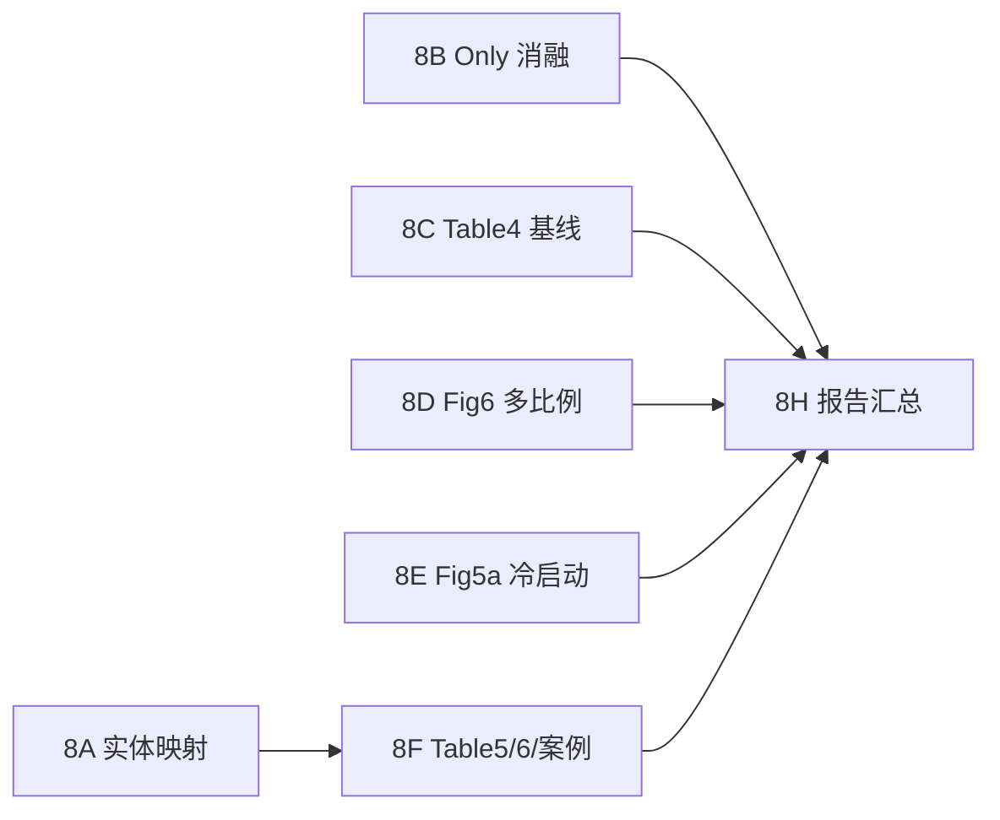

# MSAT 论文补全实施计划（Phase 8）

> **Goal:** 在 Phase 0–7 主实验已达标的前提下，补完论文中尚未复现或仅部分复现的实验与下游解释，使 `REPRODUCTION_REPORT.md` 可与 `fphar-17-1774128.pdf` 逐表对应。  
> **验收口径:** 数值与论文差距 **< 0.1** 视为通过；只要求 **趋势/表格结构/案例语义** 与论文一致。  
> **前提:** 继续使用 Zenodo 图 + 官方 `10fold_cv_split.pkl` + 现有 `train.py` / 基线脚本。

**论文:** Front. Pharmacol. 17:1774128  
**本地根目录:** `MSAT/`  
**已有报告:** `MSAT/results/REPRODUCTION_REPORT.md`

---

## 一、已完成 vs 待补（快照）

| 论文条目 | 状态 | 补全优先级 |
|----------|------|------------|
| Table 1 数据规模 | ✅ | — |
| Table 2 MSAT 主实验 | ✅ | — |
| Table 2 九基线（1:1） | ⚠️ MSAT 第一；GCN fold 离群 | P3 |
| Table 3 w/o ESA/HSP/HCI | ✅ | — |
| Table 3 Only ESA/HSP/HCI | ❌ | **P1** |
| Table 4 MSAT 1:10 | ✅ | — |
| Table 4 九基线 1:10 | ❌ | **P1** |
| Fig.6 多比例测试不平衡（1:2/1:5/1:10，训练 1:1） | ❌ | **P2** |
| Fig.5b 度分层 head-hard | ✅ | — |
| Fig.5a 文献冷启动 + 基线对比 | ⚠️ 仅有 AUC 子集 | **P2** |
| Table 5 Top-15 外部验证 | ❌ | **P0** |
| Table 6 TCM 16 系统映射 | ❌ | **P0** |
| §4.5.1 枳实→diarrhoea 多跳路径 | ❌ 实体/路径均错 | **P0** |
| 实体 ID→名称（651 CMM） | ⚠️ BioBERT 启发式，Table 5 种子大量 `mapped_id=null` | **P0 阻塞项** |
| 超参敏感性 / Supplementary | ❌ | P3 |

---

## 二、阶段划分与依赖



| 阶段 | 名称 | 预计 GPU 时间 | 依赖 |
|------|------|---------------|------|
| **8A** | 官方级 CMM/Compound/Target 名称 | 0.5–1 天（数据获取为主） | — |
| **8B** | Table 3 Only 三组消融 | ~2 h | — |
| **8C** | Table 4 九基线 1:10 | ~4–6 h | `run_baselines` 扩展 |
| **8D** | Fig.6 不平衡 sweep | ~3–4 h | `feature_extractor` 扩展 |
| **8E** | Fig.5a 冷启动完整协议 | ~2 h + 分析 | 基线 checkpoint |
| **8F** | Table 5 / Table 6 / 枳实案例 | 1 天（含规则整理） | **8A** |
| **8G** | 可选：GCN 重跑、敏感性 | 按需 | — |
| **8H** | 更新 `REPRODUCTION_REPORT.md` | 0.5 天 | 8A–8F |

---

## 三、Phase 8A — 实体映射（P0，阻塞下游）

### 问题

- `build_entity_mapping.py` 对 651 个 CMM 做 BioBERT argmax，**无官方 ID 表**。
- `paper_herb_checks` 中 Table 5 的 16 味药多数 `mapped_id=null`，且多个种子 `top_dot_id=173`（山楂），导致 Phase 7 案例语义错误。
- 图节点仅有 `x` 特征，**无内嵌名称**（已验证 `complete_hetero_graph.pt`）。

### 任务

- [ ] **8A.1** 获取与 Zenodo 图节点顺序一致的 **651 CMM 官方名单**  
  - 优先：ccTCM / 作者 GitHub `BowenShiGDPU/MSAT` 或 Zenodo 附件  
  - 备选：用 ccTCM API/导出 + 与 `herb.x` 做 BioBERT 一对一匈牙利匹配（`unique_candidates=True`），并以 Table 5 16 种子做 sanity check  
- [ ] **8A.2** 重构 `scripts/build_entity_mapping.py`  
  - 输出 `data/cctcm_herb_index.json`（`id, chinese, latin, pinyin, source`）  
  - ADR 继续 MedDRA 线性分配（已有），补充 `soc` 字段供 Table 6  
  - `paper_herb_checks` 要求：**16/16 `mapped_id` 非空且互不重复**  
- [ ] **8A.3** 新增 `data/compound_target_names.json`（可选但推荐）  
  - Compound：PubChem CID / 名称（至少覆盖 nobiletin CID 72344）  
  - Target：HGNC symbol（至少 ABCG2）  
  - 供路径解释可读化  
- [ ] **8A.4** 验收脚本 `scripts/validate_entity_mapping.py`  
  - 打印 16 种子映射表；失败则 CI 式 exit 1  

### 产物

```
MSAT/data/cctcm_herb_index.json
MSAT/data/entity_names.json          # v2
MSAT/data/compound_target_names.json # 可选
MSAT/scripts/validate_entity_mapping.py
```

---

## 四、Phase 8B — Table 3 Only 消融（P1）

### 论文要求

| Variant | ESA | HSP | HCI | 论文 AUC |
|---------|-----|-----|-----|----------|
| Only ESA | ✓ | ✗ | ✗ | 0.973 |
| Only HSP | ✗ | ✓ | ✗ | 0.971 |
| Only HCI | ✗ | ✗ | ✓ | 0.961 |

### 任务

- [ ] **8B.1** 扩展 `config.py` / `model.py`：支持 **仅启用单模块**（当前只有 w/o 开关）  
- [ ] **8B.2** 扩展 `scripts/run_ablation.py`：`only_esa`, `only_hsp`, `only_hci`  
- [ ] **8B.3** 远程 GPU 跑 3×10 折 → `summary_only_esa.json` 等  
- [ ] **8B.4** 更新 `ablation_summary.json`（7 行变体 + 论文对照列）  

### 验收（Δ<0.1）

- Only 三组 AUC **均低于 Full**  
- Only HCI **为 Only 组最低**  
- 不要求与论文 ±0.001 完全一致  

---

## 五、Phase 8C — Table 4 九基线 1:10（P1）

### 现状

- MSAT 1:10 已有：`summary_neg10.json`（AUC 0.8717）  
- 9 基线仅在 1:1 下跑过  

### 任务

- [ ] **8C.1** 扩展 `scripts/run_baselines.py`：  
  - `--neg-ratio 10` → 设置 `DataConfig.NEG_RATIO=10` + `USE_OPTIMAL_THRESHOLD=True`  
  - 结果写入 `baseline_{model}_neg10.json`  
- [ ] **8C.2** 跑 ML + GNN 共 9 模型（可 `--model gcn` 单跑）  
- [ ] **8C.3** 新增 `scripts/aggregate_table4.py` → `baseline_neg10_summary.json`  
- [ ] **8C.4** 与论文 Table 4 逐行对照（MSAT AUC 最优）  

### 参考论文 MSAT 行

`AUC 0.875±0.005, F1 0.565±0.007, MCC 0.523±0.008`

---

## 六、Phase 8D — Fig.6 测试不平衡 sweep（P2）

### 论文协议（§3.5.1.2 ii）

- **训练始终 1:1**  
- **测试** 负正比 1:2、1:5、1:10（每折固定 seed 采样一次）  
- 验证集上选 τ\* 最大化 F1，再用于测试  
- 对比模型：**MSAT + HGT + Simple-HGN + GAT**  

### 任务

- [ ] **8D.1** 扩展 `experiments/feature_extractor.py`：  
  - `test_neg_ratio: int | None` — 仅 test split 过采样负例  
  - 缓存 `fold{N}_test_neg{R}.npz`  
- [ ] **8D.2** 新建 `scripts/run_imbalance_sweep.py`  
  - ratios = [2, 5, 10]  
  - 模型列表可配置  
- [ ] **8D.3** 输出 `fig6_summary.json` + 可选 `fig6_auc_curve.csv`（供画图）  

### 验收

- 各 ratio 下 **MSAT AUC 为四模型最高**  
- ratio 增大时全体下降，MSAT 降幅 ≤ 基线（趋势）  

---

## 七、Phase 8E — Fig.5a 冷启动（P2）

### 论文协议（§4.3.1）

- 独立 **文献衍生** 验证集，96.5% CMM 训练未见  
- 报告 **Precision、MCC、AUC**，MSAT vs GNN 基线  

### 现状

- `analyze_stratified.py` 用 `edge_attr[:,2]==0` 标文献边，在测试折上算 AUC，**未做基线对比、未验证 96.5% unseen CMM**  

### 任务

- [ ] **8E.1** 新建 `scripts/run_coldstart_eval.py`  
  - 构造文献 hold-out 对（与论文一致：仅 literature 来源、且 CMM 在 train 图不可见或按边属性过滤）  
  - 统计 **unseen CMM 比例** 是否 ~96.5%  
- [ ] **8E.2** 加载 MSAT + GAT/HGT/Simple-HGN 各折预测或统一推理  
- [ ] **8E.3** 输出 `coldstart_summary.json`（Precision/MCC/AUC × 模型）  

### 验收

- MSAT Precision/MCC **高于** 三个 GNN（趋势，不要求 p 值复现）  

---

## 八、Phase 8F — Table 5 / Table 6 / 枳实案例（P0）

### 8F.1 Table 5 — 全局 Top-15 + 外部证据

**论文:** 从未标注为正例的高置信预测中取 Top 15；13/15 有库或机制支持。

- [ ] **8F.1a** 新建 `scripts/run_table5_validation.py`  
  - 输入：`saved_models/best_model_for_prediction.pt` 或各折 OOF 分数  
  - 候选池：全部 `(CMM, ADR)` 对 **减去** 训练图监督正边  
  - 输出 Top 15：`pinyin, latin, adr_pt, score_pct, database_verified, mechanistic_support`  
- [ ] **8F.1b** 证据列（最小可行）  
  - `database_verified`：预测对是否在 **全图** `herb→causes→adr` 之外、但能在 ADReCS/OpenTargets/ETCM 等代理源找到（先用「全图其他边类型路径存在」+ 人工 CSV 模板）  
  - `mechanistic_support`：是否存在 CMM→Compound→Target→ADR 路径（自动）  
- [ ] **8F.1c** 与论文 Table 5 **逐行比 ADR 名称与排序趋势**（允许 ID 映射误差，score 差 <0.1）  

### 8F.2 Table 6 — TCM 16 系统映射

- [ ] **8F.2a** 新建 `inference/tcm_mapping.py`  
  - MedDRA PT → SOC（MedDRA 词典）  
  - SOC + PT → 16 TCM 系统（规则表，覆盖论文 Table 6 15 例）  
- [ ] **8F.2b** `scripts/run_table6_mapping.py`：读 Table 5 CSV → 输出 `table6_mapping.csv`  
- [ ] **8F.2c** 验收：Vomiting→Stomach、Tinnitus→Kidney、Dizziness→Liver 等 **与论文一致**  

### 8F.3 §4.5.1 枳实 → diarrhoea 案例

- [ ] **8F.3a** 用 8A 映射定位 **正确 `herb_id`（Citrus aurantium / 枳实）**  
- [ ] **8F.3b** 扩展 `inference/graph_utils.py`  
  - 命名输出：`nobiletin (CID 72344) → ABCG2 → diarrhoea`  
  - BFS：`herb→contains→compound→binds←target←causes←adr`  
- [ ] **8F.3c** 新建 `scripts/run_case_zhishi.py` → `case_zhishi_diarrhoea.json`  
- [ ] **8F.3d** 删除或替换误导性 `phase7_top15_table6_style.*`（改为 Table 5 产物命名）  

### 产物

```
MSAT/results/table5_top15.csv
MSAT/results/table5_summary.json      # 含 support_rate
MSAT/results/table6_mapping.csv
MSAT/results/case_zhishi_diarrhoea.json
```

---

## 九、Phase 8G — 可选（P3）

| 任务 | 说明 |
|------|------|
| GCN fold9 重跑 | `baseline_gcn.json` fold9 AUC=0.712 离群；重跑单折或全流程 |
| 超参敏感性 d∈{32,64,96,128}, L∈{1,2,3,4} | 论文 §3.5.1 iv |
| Target–ADR 边移除 | Supp. Table S1 |
| FAERS 阈值 / hard negative | Supp. S2–S3 |

**仅在 8A–8F 完成后按需执行。**

---

## 十、Phase 8H — 报告与验收清单

- [ ] 更新 `MSAT/results/REPRODUCTION_REPORT.md` §10–§11  
- [ ] 新增 **「论文逐表对照」** 一节，每项 ✅/⚠️/❌  
- [ ] 全部 JSON/CSV 路径写入 `DATA_MANIFEST.md`  

### 最终 MVP（补全后）

- [ ] Table 3 七变体齐全  
- [ ] Table 4 十模型齐全  
- [ ] Fig.6 四模型 × 三 ratio  
- [ ] Fig.5a 冷启动四模型指标  
- [ ] Table 5 Top-15 + support rate  
- [ ] Table 6 十五行映射  
- [ ] 枳实案例含 nobiletin→ABCG2 路径  
- [ ] 16 种子 CMM 映射验证通过  

---

## 十一、建议执行顺序（本周）

| 顺序 | 命令/动作 | 负责人 |
|------|-----------|--------|
| 1 | 获取 ccTCM 651 名单 → 8A | 数据 |
| 2 | `validate_entity_mapping.py` 全绿 | 本地 |
| 3 | GPU 队列：`run_ablation.py --variant only_*` ×3 | 远程 |
| 4 | GPU：`run_baselines.py --neg-ratio 10 --all` | 远程 |
| 5 | `run_imbalance_sweep.py` | 远程 |
| 6 | `run_coldstart_eval.py` | 本地/远程 |
| 7 | `run_table5_validation.py` → `run_table6_mapping.py` → `run_case_zhishi.py` | 本地 |
| 8 | 刷新 REPRODUCTION_REPORT | 文档 |

---

## 十二、风险

| 风险 | 缓解 |
|------|------|
| 官方 651 CMM 名单不可得 | ccTCM 导出 + 匈牙利匹配 + 16 种子锚定 |
| Table 5 证据需人工文献 | 先做自动 mechanistic 列 + 模板人工列 |
| TCM 映射规则论文未全公开 | 从 Table 6 反推最小规则集，Supp. 图 3c/d 补全 |
| GPU 时间 | 8B/8C/8D 可夜间串行；8F 以 CPU 推理为主 |

---

## 十三、与旧计划关系

- 原 `2026-06-18-msat-reproduction.md` Phase 0–7 → **已完成主实验**  
- 本计划 = **Phase 8 补全**，不改动已达标的主训练代码，除非 8B 需要 Only 模块开关  

**下一步:** 从 **8A.1 获取 ccTCM 651 名单** 开始；完成后立即跑 `validate_entity_mapping.py`。
